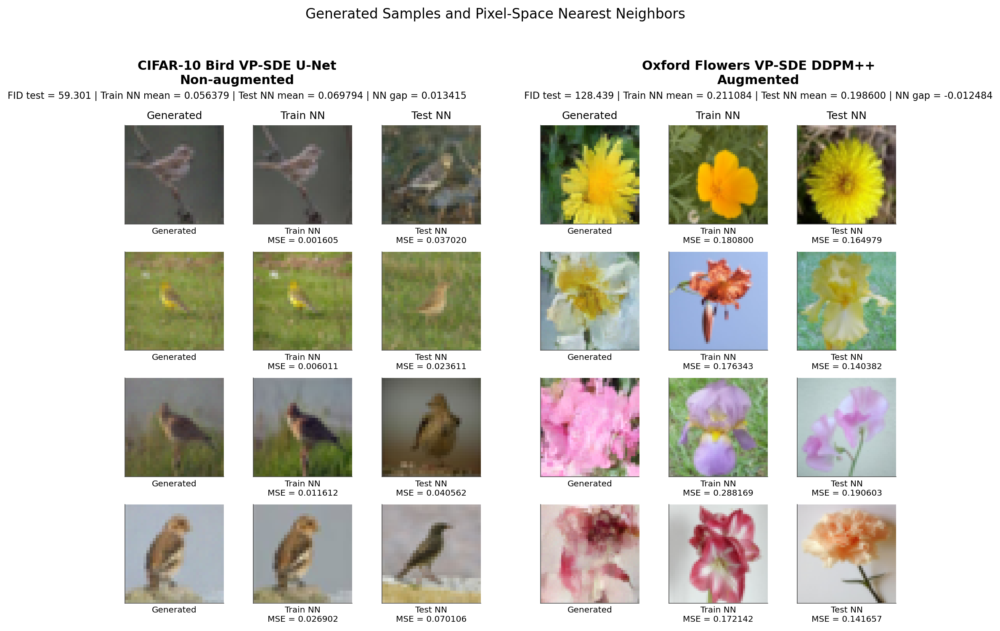

# Score-Based SDE Diffusion Models

This repository contains the notebook-first DD2424 deep learning project on score-based diffusion models formulated as stochastic differential equations. The work reproduces and extends score-based SDE diffusion experiments using VP-SDE and VE-SDE variants, with all main experiments kept as Google Colab notebooks.

The project is designed to be run in Colab with Google Drive mounted. The notebooks are the primary runnable artifacts; `src/` only contains small shared helpers that are actually imported by the notebooks.

## Models

- VP-SDE with a custom U-Net backbone.
- VP-SDE with the DDPM++/NCSN++ backbone from `score_sde_pytorch`.
- VE-SDE with an NCSN++ backbone.
- Raw and EMA checkpoints are compared where available.

## Datasets

- CIFAR-10 bird class.
- Oxford Flowers 102.
- Both augmented and non-augmented training variants are included where reported.

## Repository Structure

```text
.
├── notebooks/      # Colab notebooks for training, sampling, FID, and memorization checks
├── src/            # Shared configs, plotting helpers, and EMA/SDE utilities
├── report/         # Project report PDF
├── results/        # Text evaluation summaries
├── assets/         # Figures or presentation assets
├── checkpoints/    # Local checkpoints, ignored by git
├── requirements.txt
└── README.md
```

## Running in Google Colab

1. Upload or clone this project folder to Google Drive, for example under `MyDrive/DD2424/Project`.
2. Open a notebook from `notebooks/` in Google Colab.
3. Select a GPU runtime.
4. Run the setup cells at the top of the notebook to mount Google Drive and add the project folder to `sys.path`.
5. Run the notebook from top to bottom.

The notebooks keep their original Colab assumptions, including Drive paths and setup cells.

## Checkpoints

Large model weights are local artifacts and should not be committed. The `checkpoints/` directory is ignored by git, as are `*.pth`, `*.pt`, and `*.ckpt` files. Place checkpoint files manually in `checkpoints/` or in the Drive path expected by a notebook before running checkpoint-dependent evaluation cells.

## Key results


Augmentation helped with memorization but at the cost of worsened FID score.