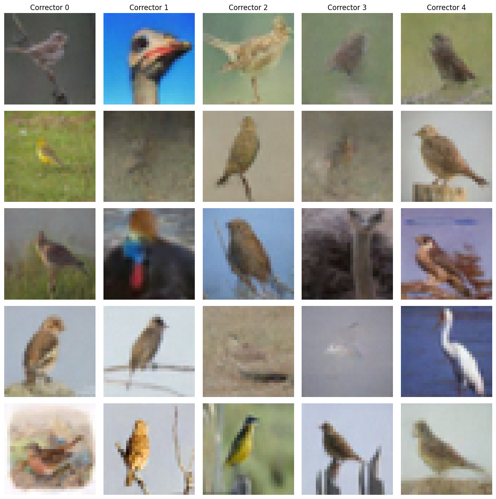

<h1 align="center">ScoreSDE Image Generation</h1>

<p align="center">
  <strong>A controlled study of diffusion-model image quality, generalization, and memorization.</strong>
</p>

<p align="center">
  
  
  
  
  
  
  
  
</p>

<p align="center">
  
  
  
  
  
  
</p>

<p align="center">
  
</p>

PyTorch implementation of continuous-time **score-based diffusion models**, based on Song et al., *Score-Based Generative Modeling through Stochastic Differential Equations*. The experiments compare VP-SDE and VE-SDE models, three score networks, two datasets, augmentation, EMA weights, sampling budgets, and Langevin corrector steps.

Read the **[project report](report/DD2424_Project.pdf)**.

## Contents

- [Overview](#overview)
- [Results](#results)
- [Evaluation](#evaluation)
- [Models and data](#models-and-data)
- [Sampling](#sampling)
- [Notebooks](#notebooks)
- [Setup](#setup)
- [Structure](#structure)
- [Limitations](#limitations)

## Overview

- Implemented continuous denoising score matching, reverse-time SDE simulation, Euler–Maruyama sampling, Langevin correction, checkpointing, and EMA weights.
- Trained and evaluated **8 conditions**: four dataset/model/SDE configurations, with and without augmentation.
- Compared a custom **62.14M-parameter U-Net** against adapted **DDPM++** and **NCSN++** architectures from [`score_sde_pytorch`](https://github.com/yang-song/score_sde_pytorch).
- Generated **CIFAR-10 Birds at 32×32** and **Oxford Flowers 102 at 48×48**.
- Evaluated models with **2048-feature FID** and nearest-neighbor pixel MSE against train and test data.
- Tested augmentation, raw versus EMA weights, 100–1000 sampling steps, 5,000-sample FID, and 0–4 corrector steps.

## Results

The main evaluation generated 1,000 images per condition, used 1,000 train and 1,000 test reference images for FID, and compared generated images with nearest neighbors from both splits.

| Dataset | Score network | SDE | Augmented | Test FID ↓ | NN gap |
|---|---|---:|:---:|---:|---:|
| CIFAR-10 Bird | NCSN++ | VE | No | 62.949 | 0.002272 |
| CIFAR-10 Bird | NCSN++ | VE | Yes | 68.876 | 0.000883 |
| CIFAR-10 Bird | DDPM++ | VP | No | 63.175 | 0.003182 |
| CIFAR-10 Bird | DDPM++ | VP | Yes | 73.846 | **0.000397** |
| CIFAR-10 Bird | U-Net | VP | No | **59.301** | 0.013415 |
| CIFAR-10 Bird | U-Net | VP | Yes | 71.561 | 0.002026 |
| Oxford Flowers | DDPM++ | VP | No | 96.011 | 0.019270 |
| Oxford Flowers | DDPM++ | VP | Yes | 128.439 | -0.012484 |

`NN gap = mean nearest-test MSE - mean nearest-train MSE`. Positive values indicate greater average closeness to the training split. This is a diagnostic, not proof of memorization.

- Lowest Bird test FID: **59.301**, from the non-augmented VP-SDE U-Net.
- That model also had the largest Bird NN gap: **0.013415**.
- U-Net augmentation reduced the NN gap by **85%**, while test FID increased by **21%**.
- In the separate EMA evaluation, U-Net FID improved from **61.14** to **52.12**.
- Corrector steps 1–4 did not beat the predictor-only FID.

## Evaluation

Each generated image was compared with its closest train and test examples using pixel MSE.

<p align="center">
  
</p>

Left: the best-FID Bird model. Right: the augmented Flower model. The figure shows generated samples and their nearest train/test images.

## Models and data

| Dataset / role | Train / test | SDE | Architecture | Parameters | Resolution |
|---|---:|---|---|---:|---:|
| CIFAR-10 Bird | 5,000 / 1,000 | VE-SDE | NCSN++ | 62.76M | 32×32 |
| CIFAR-10 Bird | 5,000 / 1,000 | VP-SDE | DDPM++ | 10.09M | 32×32 |
| CIFAR-10 Bird | 5,000 / 1,000 | VP-SDE | custom U-Net | 62.14M | 32×32 |
| Oxford Flowers 102 | 1,020 / 6,198 | VP-SDE | DDPM++ | 9.89M | 48×48 |

Main report settings: 1,760 epochs, batch size 128, AdamW, learning rate `1e-4`, weight decay `1e-4`, and EMA decay `0.995`. VP-SDE used `beta_min=0.1` and `beta_max=20`. VE-SDE used `sigma_min=0.01` and `sigma_max=50`.

## Sampling

The reverse-time sampler used 1,000 Euler–Maruyama predictor steps for the main comparison. The U-Net ablation added 1–4 Langevin corrections per step; none produced a clear FID or qualitative improvement under the tested settings.

<p align="center">
  
</p>

| Corrector steps | Test FID ↓ | NN gap |
|---:|---:|---:|
| **0** | **59.301** | 0.013415 |
| 1 | 61.199 | 0.011739 |
| 2 | 60.641 | 0.011892 |
| 3 | 60.866 | **0.011728** |
| 4 | 60.324 | 0.014788 |

## Notebooks

| Goal | Notebook(s) |
|---|---|
| Aggregate FID, memorization, plots, and corrector ablation | [`evaluation_fid_memorization.ipynb`](notebooks/evaluation_fid_memorization.ipynb) |
| Sweep 100–1000 sampling steps for raw VP and VE models | [`raw_sampling_step_sweep.ipynb`](notebooks/raw_sampling_step_sweep.ipynb) |
| VP-SDE + custom U-Net on Birds | [augmented](notebooks/vp_sde_bird_unet_augmented.ipynb) · [non-augmented](notebooks/vp_sde_bird_unet_non_augmented.ipynb) |
| VP-SDE + DDPM++ on Birds | [augmented](notebooks/vp_sde_bird_ddpmpp_augmented.ipynb) · [non-augmented](notebooks/vp_sde_bird_ddpmpp_non_augmented.ipynb) |
| VE-SDE + NCSN++ on Birds | [augmented](notebooks/ve_sde_bird_ncsnpp_augmented.ipynb) · [non-augmented](notebooks/ve_sde_bird_ncsnpp_non_augmented.ipynb) |
| VP-SDE + DDPM++ on Oxford Flowers | [augmented](notebooks/vp_sde_flowers_ddpmpp_augmented.ipynb) · [non-augmented](notebooks/vp_sde_flowers_ddpmpp_non_augmented.ipynb) |

## Setup

The notebooks target **Google Colab with a GPU and Google Drive mounted**.

1. Clone or upload this repository to Google Drive.
2. Open the notebook for the experiment you want to reproduce.
3. Select a GPU runtime in Colab.
4. Install the common dependencies:

   ```bash
   pip install -r requirements.txt
   ```

5. Update the `PROJECT_PATH`/Drive path in the notebook if your folder differs from `MyDrive/DD2424/Project`.
6. Run the notebook from top to bottom. DDPM++ and NCSN++ notebooks clone or load `score_sde_pytorch` as part of their setup.

For evaluation only, place a compatible checkpoint in the Drive path configured by the notebook. Local checkpoint files (`*.pth`, `*.pt`, and `*.ckpt`) are ignored by Git.

## Structure

```text
.
├── assets/             # README figures extracted from executed notebooks
├── notebooks/          # Training, sampling, FID, and memorization experiments
├── report/             # Final project report
├── results/            # Saved text summaries for selected evaluations
├── src/                # Shared SDE kernels, configs, EMA, and plotting helpers
├── model_checkpoints/  # Optional local weights; ignored by Git
├── requirements.txt
└── README.md
```

## Limitations

This is a compute-limited reproduction, not a state-of-the-art result. The models range from roughly 10M to 63M parameters, so architecture size, SDE family, and augmentation are not fully separated. FID should be read together with the nearest-neighbor metrics.

Full details are in the **[14-page report](report/DD2424_Project.pdf)**.
